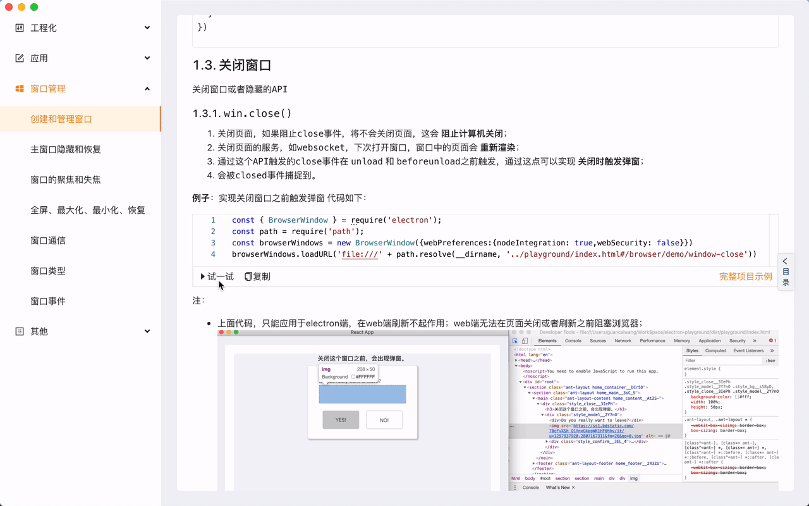
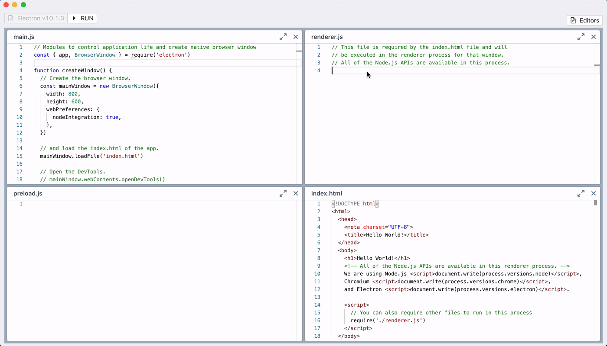
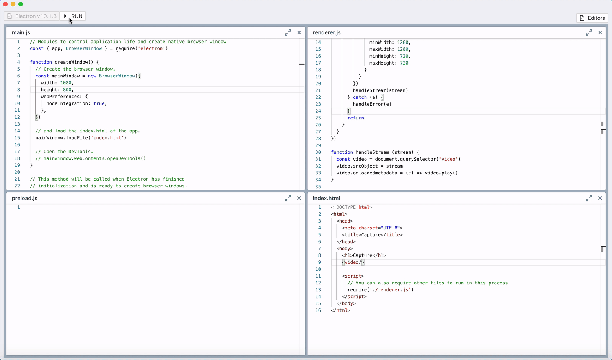
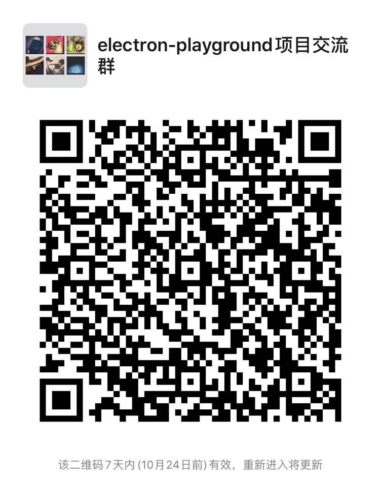

# Electron Playground

## 1. electron-playground介绍

一个快速尝试和学习[electron](https://github.com/electron/electron)的项目，对electron的api进行了归纳和总结，对常用的业务功能做了demo演示。

## 2. 特性

在文档和演练场中，几乎所有的代码都可以即时运行看到效果。亦可直接在界面上修改代码运行。



编辑器全部集成[monaco-editor](https://github.com/microsoft/monaco-editor)，编码体验接近vscode；



想要实现更复杂的操作，我们参考[fiddle](https://github.com/electron/fiddle)创建了演练场，这里编写的应用都可以独立运行。



## 3. 启动

克隆仓库到本地，安装依赖后执行
```shell
yarn start
```
编译完成后将自动启动应用

## 4. 已实现

工程化
  - 崩溃分析和收集
  - 开发调试
  - 打包问题
  - 应用更新
- 应用
  - 自定义协议
  - 系统提示和文件选择
  - 菜单
  - 系统托盘
- 窗口管理 
  - 创建和管理窗口
  - 隐藏和恢复
  - 聚焦、失焦
  - 全屏、最大化、最小化
  - 窗口通信
  - 窗口类型
  - 窗口事件
- 其他
  - 安全性
  
## 5. 规划中
- 小程序
- 小应用
- 截屏/录屏
- 微服务集成
- 自启动管理
- 性能优化
- 打包体积优化
- 更多...

## 6. 最后

如果觉得这个项目对你有用，欢迎star，另外更欢迎大家提issue哈。

当然如果有问题，可以加下面微信，有时间我们会第一时间回复。

