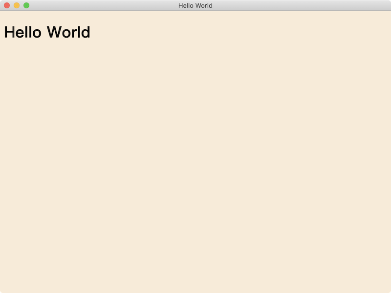
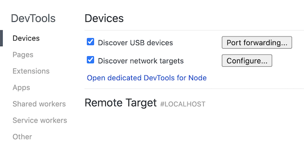
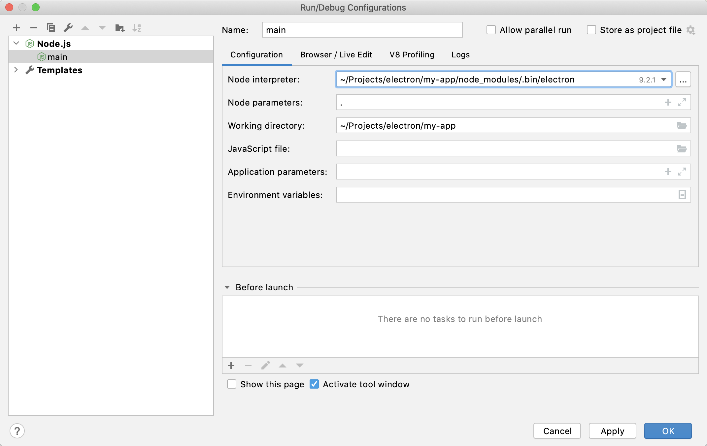

# 本地开发
  
## 快速新建一个Electron App

新建一个工作目录：
```shell
mkdir my-app && cd my-app
```
初始化**package.json**
```shell
yarn init
```
安装依赖
```shell
yarn add electron -D
```
新建index.html
```html
<!DOCTYPE html>
<html lang="en">
<head>
  <meta charset="UTF-8">
  <meta name="viewport" content="width=device-width, initial-scale=1.0">
  <title>Hello World</title>
  <style>
    html, body {
      background-color: antiquewhite;
    }
  </style>
</head>
<body>
  <h1>Hello World</h1>
</body>
</html>
```
新建index.js
```js
const { app, BrowserWindow } = require('electron')
const path = require('path')

app.on('ready', function(){
  const window = new BrowserWindow()
  window.loadFile(path.resolve(__dirname, 'src', 'index.html'))
})
```
在package.json中添加启动命令
```json
"scripts": {
  "start": "electron ."
},
```
执行启动命令
```shell
yarn start
```

显示效果如下



这样，一个十分简单的Electron App就完成了。

## 1. 正式开始

刚刚的项目虽然已经能够启动来，但还有些简单，对于需求和业务复杂的项目来说还有很多不足。

比如，主进程和渲染进程改如何调试？我想用最新的ES特性该怎么做？想用TypeScript该怎么配置？想用React，Vue，Angular来写UI呢？

接下来我们将一一解决这些问题。

### 1.1 使用Webpack来编译我们的代码

首先调整一下目录结构：

```
.
├── app                                 
│   └── index.js                        主进程入口文件
├── build                               构建相关的脚本和配置
│   └── webpack.config.js
├── output                              编译结果输出目录
└── src                                 
    └── index.html                      渲染进程入口文件 
```

我们这里选择webpack作为构建工具。

Electron本身的TypeScript类型声明文件很齐全，开发体验不错，因此这里选择TypeScript作为主要开发语言。

首先安装必要的依赖：
```shell
yarn add -D webpack webpack-cli webpack-merge typescript awesome-typescript-loader
```

在build目录添加webpack.config.base.js，配置如下：

```js
const path = require('path');

module.exports = {
  resolve: {
    extensions: ['.ts', '.tsx', '.js', '.jsx'],
    alias: {
      'app': path.resolve(__dirname, '../app'),
      'src': path.resolve(__dirname, '../src'),
    },
  },
  module: {
    rules: [{
      test: /\.tsx?$/,
      exclude: /node_modules/,
      use: [{
        loader: 'awesome-typescript-loader',
      }],
    }],
  },
  output: {
    path: path.join(__dirname, '..', 'output', 'main'),
    filename: '[name].js',
  },
  // https://webpack.js.org/configuration/node/
  // 避免webpack配置导致的__dirname和__filename和实际输出文件的不一致
  node: {
    __dirname: false,
    __filename: false,
  },
  // 启用source-map
  devtool: 'source-map',
  plugins: [
  ]
};
```

这里是基础的webpack配置，将应用于主进程和preload的代码编译。

接下来在build目录添加webpack.config.main.js作为主进程的webpack配置：

```js
const webpack = require('webpack')
const { merge } = require('webpack-merge')

const baseConfig = require('./webpack.config.base')

module.exports = merge(baseConfig, {
  mode: process.env.NODE_ENV,
  // https://webpack.js.org/configuration/target/
  // webpack可以针对多种环境或目标进行编译，包括electron-main和electron-preload。
  target: 'electron-main',
  entry: {
    index: './app/index.ts',
  },
  plugins: [
    new webpack.NamedModulesPlugin(),
    new webpack.EnvironmentPlugin({
      NODE_ENV: 'development',
    }),
  ],
})
```

添加`tsconfig.json`
```json
// https://www.typescriptlang.org/docs/handbook/tsconfig-json.html
{
  "compilerOptions": {
    "module": "commonjs",
    "moduleResolution": "node",
    "importHelpers": true,
    "target": "es2015",
    "jsx": "react",
    "esModuleInterop": true,
    "sourceMap": true,
    "noImplicitAny": true,
    "strict": true,
    "allowSyntheticDefaultImports": true,
    "experimentalDecorators": true,
    "baseUrl": ".",
    "paths": {
      "app/*": ["app/*"],
      "src/*": ["src/*"],
    },
  },
  "include": ["app/**/*"],
  "exclude": ["node_modules", "packages", "public", "mock"]
}

```

删除`app/index.js`，添加`app/index.ts`，现在我们就可以使用TypeScript来编写electron应用了。

```ts
import { app, BrowserWindow } from 'electron'
import path from 'path'

app.on('ready', function(){
  const window = new BrowserWindow()
  window.loadFile(path.resolve(__dirname, '..', '..', 'src', 'index.html'))
})
```
在package.json中添加命令
```json
"dev:main": "NODE_ENV=development webpack --config ./build/webpack.config.main.js --watch"
```

将 `main` 字段改为输出文件的路径：
```json
"main": "output/main/index.js",
```

执行

```shell
yarn dev:main
```

发现output目录下得到了编译后的`index.js`文件和sourcemap文件，接下来运行

```shell
yarn start
```

即可启动electron app

### 1.2 调试主进程

### 1.2.1 使用chrome调试

首先可以通过electron本身提供的inspect项和chrome进行调试

修改package.json中的`start`命令

```json
"start": "electron . --inspect-brk=5858",
```

运行后打开chrome，输入 `chrome://inspect`进入inspect页面，可以看到




点击 `Configure` 输入 `localhost:5858`，点击`Done`，即可在下面的Remote Target列表中看到我们的Electron应用，点击inspect便可以开始调试。

[文档参考](https://nodejs.org/en/docs/guides/debugging-getting-started/)

### 1.2.2 使用vscode调试

尽管chrome的开发者工具用来调试已经相当好用，但还是抵挡不了将debugger集成到编辑器中的诱惑：在编辑器中源代码直接打断点调试实在是太方便了。

vscode中配置十分简单，打开debug面板，点击添加配置，launch.json配置如下:
```json
{
  // Use IntelliSense to learn about possible attributes.
  // Hover to view descriptions of existing attributes.
  // For more information, visit: https://go.microsoft.com/fwlink/?linkid=830387
  "version": "0.2.0",
  "configurations": [
    {
      "type": "node",
      "request": "launch",
      "name": "Launch Program",
      "program": "${workspaceFolder}/app/index.ts",
      "cwd": "${workspaceFolder}",
      "skipFiles": [
        "<node_internals>/**"
      ],
      "runtimeExecutable": "${workspaceFolder}/node_modules/.bin/electron",
      "windows": {
        "runtimeExecutable": "${workspaceFolder}/node_modules/.bin/electron.cmd"
      },
      "outFiles": [
        "${workspaceRoot}/output/main/*.js"
      ],
      "args" : ["."]
    }
  ]
}
```

打开`app/index.ts`，在想要调试的代码左边点击打上断点，在debug面板点击`start debugging`，就会发现代码执行到断点处停住，接下来就可以自由在vscode中调试了。

[文档参考](https://www.electronjs.org/docs/tutorial/debugging-main-process-vscode)

### 1.2.3 使用webstorm调试

和vscode类似，在webstorm中也是通过添加配置来进行调试，点击添加配置，选择Node.js，填写如下：



[文档参考](https://blog.jetbrains.com/webstorm/2016/05/getting-started-with-electron-in-webstorm/)

### 1.3 调试渲染进程

#### 1.3.1 打开控制台

修改`app/index.ts`中的代码:
```ts
app.on('ready', function(){
  const window = new BrowserWindow()
  window.loadFile(path.resolve(__dirname, '..', '..', 'src', 'index.html'))
  if(process.env.NODE_ENV === 'development'){
    window.webContents.openDevTools()
  }
})
```
在开发环境下，就会自动打开chrome调试工具了

#### 1.3.2 添加preload

在`app`文件夹下添加`preload.ts`
```ts
import { ipcRenderer } from 'electron';

async function getAppInfo() {
  return await ipcRenderer.invoke('app/get_basic_info') 
}

const JSBridge = {
  getAppInfo,
};

window.JSBridge = JSBridge;

export type JSBridgeType = typeof JSBridge;

```

并在app中添加对ipc的处理：
```ts
app.on('will-finish-launching', function(){
  ipcMain.handle('app/get_basic_info', function handleAppGetBasicInfo(){
    return {
      version: app.getVersion(),
      name: app.name,
    }
  })
})
```

由于window上没有JSBridge属性，ts会报错，此时我们在根目录添加一个global.d.ts:

```ts
import { JSBridgeType } from "app/preload";

declare global{
  interface Window{
    JSBridge: JSBridgeType
  }
}
```

接下来在build下添加`webpack.config.preload.js`，将preload也输出到output目录下:

```js
const webpack = require("webpack");
const { merge } = require("webpack-merge");

const baseConfig = require("./webpack.config.base");

module.exports = merge(baseConfig, {
  mode: process.env.NODE_ENV,
  target: "electron-preload",
  entry: {
    preload: "./app/preload.ts",
  },
  plugins: [
    new webpack.NamedModulesPlugin(),
    new webpack.EnvironmentPlugin({
      NODE_ENV: "development",
    }),
  ],
});
```

在package.json中添加一条preload的开发命令:
```json
"dev:preload": "NODE_ENV=development webpack --config ./build/webpack.config.preload.js --watch"
```

启动后就会发现output/main目录下多出一个preload.js及sourcemap

修改`app/index.ts`，创建BrowserWindow时注入preload.js
```ts
const PRELOAD = path.resolve(__dirname, 'preload.js')

app.on('ready', function(){
  const window = new BrowserWindow({webPreferences: {preload: PRELOAD}})
  window.loadFile(path.resolve(__dirname, '..', '..', 'src', 'index.html'))
  if(process.env.NODE_ENV === 'development'){
    window.webContents.openDevTools()
  }
})
```

在`app/index.html`中添加按钮获取app信息:
```html
<!DOCTYPE html>
<html lang="en">
  <head>
    <meta charset="UTF-8" />
    <meta name="viewport" content="width=device-width, initial-scale=1.0" />
    <title>Hello World</title>
    <style>
      html,
      body {
        background-color: antiquewhite;
      }
    </style>
    <script>
      async function handleGetAppInfo() {
        const { version, name } = await window.JSBridge.getAppInfo();
        console.log(version,name)
        document.querySelector('#version').innerText = version
        document.querySelector('#name').innerText = name
      }
    </script>
  </head>
  <body>
    <h1>Hello World</h1>
    <dl>
      <dt>version</dt> <dd id="version"></dd>
      <dt>name</dt> <dd id="name"></dd>
    </dl>
    <button onclick="handleGetAppInfo()">get app info</button>
  </body>
</html>
```

启动app，点击按钮，发现能够正常获取到app信息

至此我们基本的开发流程就都实现了，主要包括：
- 主进程，渲染进程，preload的编译
- 主进程和渲染进程的调试

看起来是完备了，但开发时就会发现还不够用呢。接下来对这个流程做一些补充

### 2 流程完善

#### 2.1 启动命令完善

首先安装cross-env和concurrently
```shell
yarn add -D cross-env concurrently
```
修改`dev:main`和`dev:preload`命令并添加`dev`命令：
```json
"dev:main": "webpack --config ./build/webpack.config.main.js --watch",
"dev:preload": "webpack --config ./build/webpack.config.preload.js --watch",
"dev": "cross-env NODE_ENV=development concurrently \"npm run dev:main\" \"npm run dev:preload\""
```

cross-env用于兼容各平台下的环境变量设置，concurrently用于同时运行多个webpack编译的watch模式。之后app的编译只需运行`yarn dev`即可

#### 2.2 使用React做渲染进程开发

首先用`create-react-app`创建一个React应用，在项目根目录下运行

```shell
yarn create react-app renderer
```

进入renderer目录运行`yarn start`，应用默认在2333端口启动，如果报错`The react-scripts package provided by Create React App requires a dependency: webpack`，可以在renderer目录下添加.env文件：
```
SKIP_PREFLIGHT_CHECK=true
```

这时候我们将`app/index.ts`中的`window.loadFile ...`改为

```ts
window.loadURL('http://localhost:2333')
```

重启Electron应用即可看到渲染的窗口加载了本地的React应用

但是这里会有一个问题，在打包时我们会将渲染进程的代码打包进去，窗口加载实际上是通过loadFile的方式进行的，如果本地开发的时候使用本地http地址开发，实际效果和打包出来的效果是会有出入的，因此我们再做一些修改，将开发时生成的文件输出到`output/renderer`目录下，然后通过loadFile的方式加载它。

那么我们就需要修改cra项目的webpack中对应的output配置和path中的appBuild配置来改变输出目录，然后修改devServer的配置让开发时也输出文件，并且修改socket配置保证热更新能正常使用。

因为cra项目本身没有将配置暴露出来，这里我们做的改动不多，因此选择使用`react-app-rewired`而非eject弹出配置。

首先安装依赖

```shell
yarn add -D react-app-rewired react-dev-utils
```

然后在renderer目录下新建`config-overrides.js`

```js
const path = require('path')
const OUTPUT_PATH = path.resolve(__dirname, '..', 'output', 'renderer')

module.exports = {
    webpack: function(config, env) {
        // 修改输出目录
        config.output.path = OUTPUT_PATH
        // 修改publicPath，否则静态资源文件会引用失败
        config.output.publicPath = './'

        return config;
    },
    devServer: function(configFunction) {
        return function(proxy, allowedHost) {
            const config = configFunction(proxy, allowedHost);

            // 将文件输出到硬盘
            config.writeToDisk = true
            // 修改sock相关配置保证热更新功能正常
            config.host = process.env.HOST || '0.0.0.0';
            config.sockHost = process.env.WDS_SOCKET_HOST;
            config.sockPath = process.env.WDS_SOCKET_PATH; // default: '/sockjs-node'
            config.sockPort = process.env.WDS_SOCKET_PORT;

            return config;
        };
    },
    paths: function(paths, env) {
        // 修改build下的输出目录
        paths.appBuild = OUTPUT_PATH
        return paths;
    },
}
```

重新启动react项目，发现`output/renderer`目录下输出了对应的静态文件

然后我们将`app/index.ts`中的`window.loadURL ...`注释，添加一行
```ts
// window.loadURL('http://localhost:2333')
window.loadFile(path.resolve(__dirname, '..', '..', 'output', 'renderer', 'index.html'))
```

重新启动应用，发现加载成功。


### 2.3 给devtools添加plugins

渲染进程使用了react进行开发，为了更方便的调试，我们来给devtools安装浏览器插件。

首先找到chrome插件的位置
- windows
```
%LOCALAPPDATA%\Google\Chrome\User Data\Default\Extensions
```
- MacOS
```
~/Library/Application Support/Google/Chrome/Default/Extensions
```

- Linux，有几个可能的路径
```
~/.config/google-chrome/Default/Extensions/
~/.config/google-chrome-beta/Default/Extensions/
~/.config/google-chrome-canary/Default/Extensions/
~/.config/chromium/Default/Extensions/
```

打开目录会发现下面都是根据以扩展id命名的文件夹，想要找到扩展对应的id，可以在chrome中打开`chrome://extensions/`，点击对应扩展的详细信息，即可从url参数上找到id。

以`React Developer Tools`在MacOS上的为例，在`app/index.ts`中添加：
```ts
const EXTENSION_PATH_REACT_DEV_TOOLS = path.join('/Users/wangshuwen/Library/Application Support/Google/Chrome/Default/Extensions/', 'fmkadmapgofadopljbjfkapdkoienihi', '4.8.2_0')

...

app.on('ready', async function () {
  const e = await session.defaultSession.loadExtension(EXTENSION_PATH_REACT_DEV_TOOLS)

  const window = new BrowserWindow({webPreferences: {preload: PRELOAD}})
  window.loadURL('http://localhost:2333')
  
  ...
})
```

由于Electron本身原因，通过`session.loadExtension`添加的插件目前React Dev Tools在file协议下无法访问文件，需要在http协议下进行调试。

备选方案：改为使用`BrowserWindow.addDevToolsExtension`方法添加插件，在Electron 9.0.0版本以下生效
```ts
app.on('ready', async function () {
  BrowserWindow.addDevToolsExtension(EXTENSION_PATH_REACT_DEV_TOOLS)
  // const e = await session.defaultSession.loadExtension(EXTENSION_PATH_REACT_DEV_TOOLS)

  ...
})
```

但是注意这个方法即将被Electron废弃，待Electron修复`session.loadExtension`的问题后可以更换掉此方法。

如果觉得手动找插件添加的方式过于麻烦，也可以使用[electron-devtools-installer](https://github.com/MarshallOfSound/electron-devtools-installer)这个库来进行扩展管理。
 
## 3. 相关文档
- [devtools-extension](https://www.electronjs.org/docs/tutorial/devtools-extension)
- [session#load-extension](https://www.electronjs.org/docs/api/session#sesloadextensionpath)
- [Extensions don't work with file:// protocol since 9.0.0](https://github.com/electron/electron/issues/24011)
