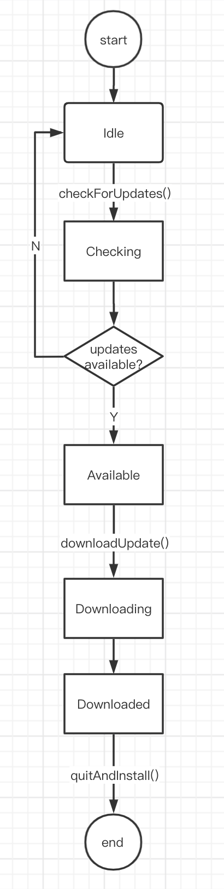

# 自动更新

前面打包流程基于Electron-Builder，因此以下的更新讨论也是基于其提供的[electron-updater]()。

## 1 关于electron-updater

### 1.1 适用场景

electron-updater只适用于以下类型的应用包：
- MacOS: DMG
- Windows: NSIS
- Linux: AppImage

### 1.2 提供的API

[文档](https://www.electron.build/auto-update#api)


| API方法                                     | 功能                   |
| ------------------------------------------- | ---------------------- |
| `checkForUpdates()`                         | 检查更新               |
| `checkForUpdatesAndNotify()`                | 检查更新，有更新则提示 |
| `downloadUpdate(cancellationToken)`         | 下载更新               |
| `getFeedURL()`                              | 获取更新服务链接       |
| `setFeedURL(options)`                       | 设置更新服务链接       |
| `quitAndInstall(isSilent, isForceRunAfter)` | 退出应用并安装更新     |

### 1.3 提供的事件

[文档](https://www.electron.build/auto-update#events)

| 事件                 | 触发         |
| -------------------- | ------------ |
| error                | 更新错误     |
| checking-for-update  | 检查更新中   |
| update-available     | 有可用更新   |
| update-not-available | 没有可用更新 |
| download-progress    | 下载更新中   |
| update-downloaded    | 更新下载完成 |

### 1.4 一个简单的更新示例
在主进程监听检查更新事件
```ts
import { autoUpdater } from 'electron-updater'
import { ipcMain } from 'electron'

ipcMain.on('CHECK_FOR_UPDATE', function(){
  autoUpdater.checkForUpdatesAndNotify()
})
```

在渲染进程点击按钮发送ipc事件检查更新(以React为例)
```tsx
import React from 'react';
import { ipcRenderer } from 'electron'
import './App.css';

function App() {
  return (
    <div className="App">
      <button onClick={ipcRenderer.send('CHECK_FOR_UPDATE')}>检查更新</button>
    </div>
  );
}

export default App;
```

注意创建BrowserWindow时需要设置webPreferences属性
```ts
const window = new BrowserWindow({
  webPreferences: {
    webSecurity: false,
    nodeIntegration: true,
  },
});
```

## 2. 更新服务的设计

上面寥寥几行代码就实现了一个简单的更新功能，但是这个功能在复杂的业务场景中往往没有那么适合，因此我们在这里开始来设计一个贴合常见场景的更新方案。

### 2.1 需要实现的功能

1. 查看更新信息
1. 用户手动检查更新;
1. 应用启动时静默检查更新;
1. 应用在后台定时检查更新;
1. 用户手动下载更新;
1. 下载进度显示;
1. 用户手动退出安装更新;
1. 通过版本号控制强制更新; 
1. 日志;
1. 开发时请求本地服务做测试;

### 2.2 更新流程

更新过程的所有状态:

| 状态        | 描述         |
| ----------- | ------------ |
| Idle        | 空闲         |
| Checking    | 检查中       |
| Available   | 有可下载更新 |
| Downloading | 下载中       |
| Downloaded  | 下载完成     |

状态流程如图



### 2.3 接口设计

根据上述功能，对更新服务做一个初步的设计

```ts
// app/updater.ts
import { autoUpdater, UpdateInfo } from 'electron-updater'

interface CheckResult{
  // 是否有更新
  available: boolean
  // 更新内容
  updateInfo: UpdateInfo
}

interface ProgressInfo {
  total: number
  delta: number
  transferred: number
  percent: number
  bytesPerSecond: number
}

// 下载进度回调
type DownloadProgressCallback = (p: ProgressInfo) => void
// 下载结束回调
type DownloadedCallback = () => void

abstract class AppUpdateService {
  // 检查更新
  public abstract checkUpdate(): CheckResult
  // 下载更新
  public abstract downloadUpdate(params: {onDownloadProgress: DownloadProgressCallback, onDownloaded: DownloadedCallback }): void
  // 应用更新
  public abstract applyUpdate(): void
}
```

但是由于ipc通信的限制，无法传递回调函数，因此我们在这里考虑将更新服务的业务功能封装都移到渲染进程，主进程只提供基本的初始化服务和接口方法的封装。

`app/updater.ts`
```ts
import { autoUpdater } from "electron-updater";
import logger from "electron-log";
import { BrowserWindow, ipcMain, app } from 'electron';

function checkUpdate() {
  return autoUpdater.checkForUpdates();
}

function downloadUpdate() {
  return autoUpdater.downloadUpdate();
}

function applyUpdate() {
  return autoUpdater.quitAndInstall();
}

function sendToAllBrowserWindows(channel: string, ...args: unknown[]) {
  const browserWindows = BrowserWindow.getAllWindows()
  browserWindows.forEach(bw=>bw.webContents.send(channel, ...args))
}

function init() {
  // 日志
  logger.transports.file.level = "info";
  autoUpdater.logger = logger;

  // 禁用自动下载
  autoUpdater.autoDownload = false;
  // 启用退出app时自动安装更新
  autoUpdater.autoInstallOnAppQuit = true;

  // 监听事件并发送到渲染进程
  const events = [
    "error",
    "checking-for-update",
    "update-available",
    "update-not-available",
    "download-progress",
    "update-downloaded",
  ]
  events.forEach((eventName) => autoUpdater.on(eventName, sendToAllBrowserWindows.bind(null, 'APP_UPDATER/STATUS_CHANGE')));

  // 通过接收渲染进程发送的ipc调用方法
  ipcMain.on('APP_UPDATER/CHECK_UPDATE', checkUpdate)
  ipcMain.on('APP_UPDATER/DOWNLOAD_UPDATE', downloadUpdate)
  ipcMain.on('APP_UPDATER/APPLY_UPDATE', applyUpdate)
}

app.once('will-finish-launching', init)

export const AppUpdater = {
  checkUpdate,
  downloadUpdate,
  applyUpdate,
}
```

在渲染进程，我们首先创建一个自定义hooks来实现接收更新状态变更并通过`createContext`来实现组件状态共享。
`renderer/src/Hooks/useAppUpdate.js`
```jsx
import React, { useState, useEffect, useContext, createContext } from "react";
import { ipcRenderer } from "electron";

export function useAppUpdate() {
  const [status, setStatus] = useState(null);
  const [updateInfo, setUpdateInfo] = useState(null);
  const [updateProgressInfo, setUpdateProgressInfo] = useState(null);
  const [error, setError] = useState(null);

  const checkUpdate = () => ipcRenderer.send('APP_UPDATER/CHECK_UPDATE')
  const downloadUpdate = () => ipcRenderer.send('APP_UPDATER/DOWNLOAD_UPDATE')
  const applyUpdate = () => ipcRenderer.send('APP_UPDATER/APPLY_UPDATE')

  useEffect(() => {
    ipcRenderer.on("APP_UPDATER/STATUS_CHANGE", (event, updateEventName, ...args) => {
        console.log(`updater#${updateEventName}: `, ...args);

        setStatus(updateEventName);

        switch (updateEventName) {
          case "error":
            setError(args[0]);
            break;
          case "checking-for-update":
            break;
          case "update-available":
            setUpdateInfo(args[0]);
            break;
          case "update-not-available":
            break;
          case "download-progress":
            setUpdateProgressInfo(args[0]);
            break;
          case "update-downloaded":
            setUpdateInfo(args[0]);
            break;

          default:
            break;
        }
      }
    );
  }, []);

  return { 
    status, updateInfo, updateProgressInfo, error, 
    checkUpdate, downloadUpdate, applyUpdate,
  };
}

const UpdaterContext = createContext();

export const UpdaterProvider = ({ children }) => {
  const state = useAppUpdate();
  return <UpdaterContext.Provider value={state}>{children}</UpdaterContext.Provider>;
};

export function useUpdaterContext(){
  const store = useContext(UpdaterContext)
  return store
}
```
新建一个AboutPanel组件，在组件中显示更新信息下载进度，已经更新按钮等
`renderer/src/Components/AboutPanel/index.jsx`
```jsx
import React, {useMemo} from 'react'
import { useUpdaterContext } from '../../Hooks/useAppUpdate'

export function AboutPanel() {
  const { 
    status, updateInfo, updateProgressInfo, error, 
    checkUpdate, downloadUpdate, applyUpdate,
   } = useUpdaterContext()

   const Button = useMemo(()=>{
    if(status === 'update-available'){
      return <button onClick={downloadUpdate}>Download Updates</button>
    }
    if(status === 'download-progress'){
      return <button>Downloading...</button>
    }
    if(status === 'update-downloaded'){
      return <button onClick={applyUpdate}>Apply Updates</button>
    }
    return <button onClick={checkUpdate}>Check for Updates</button>
   }, [status])

   const Info = useMemo(()=>{
     if(status === 'error'){
       console.log('error',error)
       return <> 
          <p style={{color: 'lightpink'}}>{error?.name}</p> 
          <p style={{color: 'lightpink'}}>{error?.message}</p> 
          <p style={{color: 'lightpink'}}>{error?.stack}</p> 
        </>
     }
     if(status === 'checking-for-update'){
       return <p>Checking...</p>
     }
    if(status ==='update-not-available'){
      return <p>No Updates Available</p>
    }
    if(updateInfo){
      const {version, releaseName, releaseNotes, releaseDate} = updateInfo
      return <>
        <p>version: {version}</p>
        <p>date: {releaseDate}</p>
        <p>name: {releaseName}</p>
        <p>notes: {releaseNotes}</p>
      </>
    }
   }, [status, updateInfo, error])

   return <div>
      {Info}

      {
        status === 'download-progress' && Boolean(updateProgressInfo) && 
        <div style={{backgroundColor: 'grey', width: 300, height: 20, margin: '12px auto'}}>
          <div style={{backgroundColor: 'cornflowerblue', height: 20, width: 300 * updateProgressInfo.percent / 100}}></div>
        </div>
      }

      {Button}
   </div>
}
```

新建一个UpdateChecker组件，在这个组件中做静默检查、定时检查和更新提示
`renderer/src/Components/UpdateChecker/index.jsx`
```jsx
import React from 'react'
import { useAppUpdate } from '../../Hooks/useAppUpdate'
import { useEffect } from 'react'

export function UpdateChecker(){
  const {checkUpdate, downloadUpdate, applyUpdate, updateInfo, status, updateProgressInfo} = useAppUpdate()

  useEffect(()=>{
    let timeout
    function scheduleCheckUpdate(){
      if(!['checking-for-update', 'update-available', 'download-progress', 'update-downloaded'].includes(status)){
        checkUpdate()
      }
      timeout = setTimeout(() => {
        scheduleCheckUpdate()
      }, 1000 * 60 *60);  
    }
    scheduleCheckUpdate()

    return () => clearTimeout(timeout)
  }, [])

  useEffect(() => {
    if(status === 'update-available'){
		  // eslint-disable-next-line no-restricted-globals
      const result = confirm('Updates available, download instantly?')
      if(result){
        downloadUpdate()
      }
    }
    if(status === 'update-downloaded'){
		  // eslint-disable-next-line no-restricted-globals
      const result = confirm('Download completed, apply updates?')
      if(result){
        applyUpdate()
      }
    }
  }, [status])

  return null
}
```

一个基本的自动更新服务就完成了
