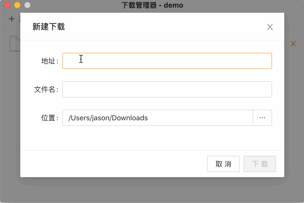
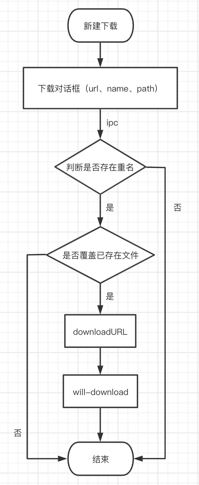
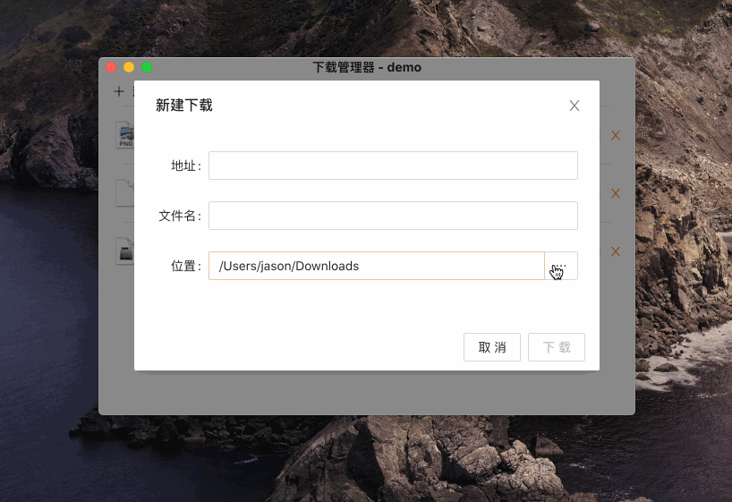
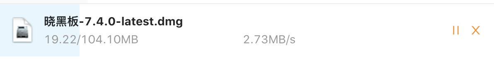
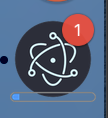
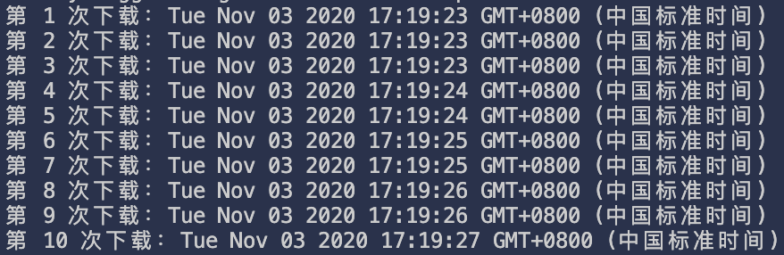

## 下载管理器

点击“试一试”按钮体验一下。

```js
// @@code-renderer: runner
// @@code-props: {hideRight: true, mProcess: false}
const {ipcRenderer} = require('electron')
ipcRenderer.invoke('openDownloadManager', '/download-manager/demo')
```

文件下载是我们开发中比较常见的业务需求，比如：导出 excel。

web 应用文件下载存在一些局限性，通常是让后端将响应的头信息改成 `Content-Disposition: attachment; filename=xxx.pdf`，触发浏览器的下载行为。

在 electron 中的下载行为，都会触发 session 的 [will-download](https://www.electronjs.org/docs/api/session#instance-events) 事件。在该事件里面可以获取到 [downloadItem](https://www.electronjs.org/docs/api/download-item) 对象，通过 [downloadItem](https://www.electronjs.org/docs/api/download-item) 对象实现一个简单的文件下载管理器：



## 如何触发下载

由于 electron 是基于 chromium 实现的，通过调用 webContents 的 [downloadURL](https://www.electronjs.org/docs/api/web-contents#contentsdownloadurlurl) 方法，相当于调用了 chromium 底层实现的下载，会忽略响应头信息，触发 [will-download](https://www.electronjs.org/docs/api/session#instance-events) 事件。

```js
// 触发下载
win.webContents.downloadURL(url)

// 监听 will-download
session.defaultSession.on('will-download', (event, item, webContents) => {})
```
  
## 下载流程图



## 功能设计

在上面的效果图中，实现的简单文件下载管理器功能包含：

- 设置保存路径
- 暂停/恢复和取消
- 下载进度
- 下载速度
- 下载完成
- 打开文件和打开文件所在位置
- 文件图标
- 下载记录

### 设置保存路径

如果没有设置保存路径，electron 会自动弹出系统的保存对话框。不想使用系统的保存对话框，可以使用 [setSavePath](https://www.electronjs.org/docs/api/download-item#downloaditemsetsavepathpath) 方法，当有重名文件时，会直接覆盖下载。

```js
item.setSavePath(path)
```

为了更好的用户体验，可以让用户自己选择保存位置操作。当点击位置输入框时，渲染进程通过 ipc 与主进程通信，打开系统文件选择对话框。



主进程实现代码：

```ts
/**
 * 打开文件选择框
 * @param oldPath - 上一次打开的路径
 */
const openFileDialog = async (oldPath: string = app.getPath('downloads')) => {
  if (!win) return oldPath

  const { canceled, filePaths } = await dialog.showOpenDialog(win, {
    title: '选择保存位置',
    properties: ['openDirectory', 'createDirectory'],
    defaultPath: oldPath,
  })

  return !canceled ? filePaths[0] : oldPath
}

ipcMain.handle('openFileDialog', (event, oldPath?: string) => openFileDialog(oldPath))
```

渲染进程代码：

```js
const path = await ipcRenderer.invoke('openFileDialog', 'PATH')

console.log(path)
```

### 暂停/恢复和取消

拿到 [downloadItem](https://www.electronjs.org/docs/api/download-item) 后，暂停、恢复和取消分别调用 `pause`、`resume` 和 `cancel` 方法。当我们要删除列表中正在下载的项，需要先调用 cancel 方法取消下载。

### 下载进度

在 [downloadItem](https://www.electronjs.org/docs/api/download-item) 中监听 updated 事件，可以实时获取到已下载的字节数据，来计算下载进度和每秒下载的速度。

```js
// 计算下载进度
const progress = item.getReceivedBytes() / item.getTotalBytes()
```



在下载的时候，想在 Mac 系统的程序坞和 Windows 系统的任务栏展示下载信息，比如：
 - 下载数：通过 app 的 [badgeCount](https://www.electronjs.org/docs/api/app#appbadgecount-linux-macos) 属性设置，当为 0 时，不会显示。也可以通过 dock 的 [setBadge](https://www.electronjs.org/docs/api/app#appsetbadgecountcount-linux-macos) 方法设置，该方法支持的是字符串，如果不要显示，需要设置为 ''。
 - 下载进度：通过窗口的 [setProgressBar](https://www.electronjs.org/docs/api/browser-window#winsetprogressbarprogress-options) 方法设置。

> 由于 Mac 和 Windows 系统差异，下载数仅在 Mac 系统中生效。加上 process.platform === 'darwin' 条件，避免在非 Mac、Linux 系统下出现异常错误。

下载进度（Windows 系统任务栏、Mac 系统程序坞）显示效果：




```js
// mac 程序坞显示下载数：
// 方式一
app.badgeCount = 1
// 方式二
app.dock.setBadge('1')

// mac 程序坞、windows 任务栏显示进度
win.setProgressBar(progress)
```

### 下载速度

由于 [downloadItem](https://www.electronjs.org/docs/api/download-item) 没有直接为我们提供方法或属性获取下载速度，需要自己实现。

> 思路：在 updated 事件里通过 getReceivedBytes 方法拿到本次下载的字节数据减去上一次下载的字节数据。

```js
// 记录上一次下载的字节数据
let prevReceivedBytes = 0

item.on('updated', (e, state) => {
  const receivedBytes = item.getReceivedBytes()
  // 计算每秒下载的速度
  downloadItem.speed = receivedBytes - prevReceivedBytes
  prevReceivedBytes = receivedBytes
})
```

> 需要注意的是，updated 事件执行的时间约 500ms 一次。


### 下载完成

当一个文件下载完成、中断或者被取消，需要通知渲染进程修改状态，通过监听 [downloadItem](https://www.electronjs.org/docs/api/download-item) 的 done 事件。

```js
item.on('done', (e, state) => {
  downloadItem.state = state
  downloadItem.receivedBytes = item.getReceivedBytes()
  downloadItem.lastModifiedTime = item.getLastModifiedTime()

  // 通知渲染进程，更新下载状态
  webContents.send('downloadItemDone', downloadItem)
})
```

### 打开文件和打开文件所在位置

使用 electron 的 shell 模块来实现打开文件（[openPath](https://www.electronjs.org/docs/api/shell#shellopenpathpath)）和打开文件所在位置（[showItemInFolder](https://www.electronjs.org/docs/api/shell#shellshowiteminfolderfullpath)）。

> 由于 openPath 方法支持返回值 `Promise<string>`，当不支持打开的文件，系统会有相应的提示，而 showItemInFolder 方法返回值是 `void`。如果需要更好的用户体验，可使用 nodejs 的 fs 模块，先检查文件是否存在。

```ts
import fs from 'fs'

// 打开文件
const openFile = (path: string): boolean => {
  if (!fs.existsSync(path)) return false

  shell.openPath(path)
  return true
}

// 打开文件所在位置
const openFileInFolder = (path: string): boolean => {
  if (!fs.existsSync(path)) return false

  shell.showItemInFolder(path)
  return true
}
```

### 文件图标

很方便的是使用 app 模块的 [getFileIcon](https://www.electronjs.org/docs/api/app#appgetfileiconpath-options) 方法来获取系统关联的文件图标，返回的是 `Promise<NativeImage>` 类型，我们可以用 toDataURL 方法转换成 base64，不需要我们去处理不同文件类型显示不同的图标。

```ts
const getFileIcon = async (path: string) => {
  const iconDefault = './icon_default.png'
  if (!path) Promise.resolve(iconDefault)

  const icon = await app.getFileIcon(path, {
    size: 'normal'
  })

  return icon.toDataURL()
}
```

### 下载记录

随着下载的历史数据越来越多，使用 [electron-store](https://github.com/sindresorhus/electron-store) 将下载记录保存在本地。
