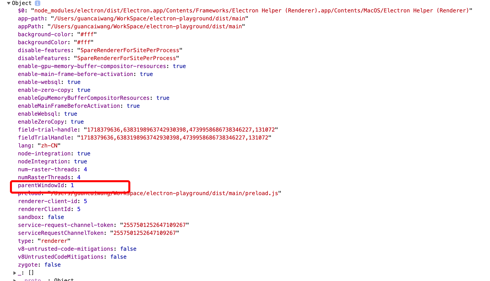

## 1. 窗口之间的通信
### 1.1. 主进程干预方式
主进程是可以干预渲染进程生成新的窗口的，只需要在创建窗口时，`webContents` 监听 `new-window` 

```javascript
import path from 'path'
import { PRELOAD_FILE } from 'app/config'
import { browserWindow } from 'electron';

const BaseWebPreferences: Electron.BrowserWindowConstructorOptions['webPreferences'] = {
  nodeIntegration: true,
  webSecurity: false,
  preload: path.resolve(__dirname, PRELOAD_FILE),
  enableRemoteModule:true,
}


// 创建窗口监听
browserWindow.webContents.on('new-window', (event, url, frameName, disposition) => {
    event.preventDefault()
    // 在通过BrowserWindow创建窗口
    const win = new BrowserWindow({ 
      show:false, 
      webPreferences: {
        ...BaseWebPreferences,
        additionalArguments:[`--parentWindow=${browserWindow.id}`] // 把父窗口的id传过去
        enableRemoteModule:true
      } 
    });
    win.loadURl(url);
    win.once('ready-to-show',()=>{
        win.show()
    })
})
```
在preload.js文件`window.process.argv`，便能拿到父窗口的id，`window.process.argv`是一个字符串数组，可以使用<a href='https://github.com/yargs/yargs'>yargs</a>来解析

preload.js 代码
```javascript
import { argv } from 'yargs'
console.log(argv);
```

拿到父窗口的id，便可以通信了

__试一试__

```javascript
// @@code-renderer: runner
// @@code-props: { hideRight: true, height:'600px' }
const path = require('path')
const { BrowserWindow } = require('electron')

const BaseWebPreferences = {
  // // 集成node
  nodeIntegration: true,
  // // 禁用同源策略
  // webSecurity: false,
  // 预加载脚本 通过绝对地址注入
  preload: path.resolve(__dirname, './communication1.js'),
  enableRemoteModule:true
}

// 主窗口代码
const parent = new BrowserWindow({ webPreferences: BaseWebPreferences, x: 100, y: 0 })
parent.loadURL(
  'file:///' + path.resolve(__dirname, '../playground/index.html#/demo/communication-part1/main')
)

parent.webContents.on('new-window', (event, url, frameName, disposition) => {
  event.preventDefault()

  // 在通过BrowserWindow创建窗口 // 子窗口代码
  const son = new BrowserWindow({
    webPreferences: {
      ...BaseWebPreferences,
      additionalArguments: ['--parentWindowId=' + parent.id],
    },
  })
  son.webContents.openDevTools()
  son.loadURL(
    'file:///' +
      path.resolve(__dirname, '../playground/index.html#/demo/communication-part1/client'),
  )
})
```
__其余代码如下__:
主窗口代码
```javascript
import React, { ReactElement, useEffect } from 'react'
import style from '../style.module.less'

export default function Communication(): ReactElement {
  useEffect(() => {
    document.title = '父窗口'
  }, [])

  return (
    <div className={style.wrap}>
      <a href='http://www.github.com' target='__blank'>
        通过a标签target=__blank打开新的窗口
      </a>
      <div
        onClick={() => {
          window.open('http://www.github.com')
        }}>
        通过window.open打开新的窗口
      </div>
    </div>
  )
}

```
子窗口代码
```javascript
import React, { ReactElement, useEffect, useState } from 'react'
import style from '../style.module.less'

const COUNT_NUM = 5

export default function Communication(): ReactElement {
  const [num, setNum] = useState(COUNT_NUM)

  useEffect(() => {
    document.title = '子窗口'
    let timer: NodeJS.Timeout

    if (num > 0) {
      timer = setTimeout(() => {
        setNum(num - 1)
      }, 1000)
    } else {
      // @ts-ignore
      window.send('hello')
      window.close()
    }
    return () => {
      timer && clearTimeout(timer)
    }
  }, [num])

  return <div className={style.countDown}>子窗口 {num} 秒之后，请看主窗口</div>
}

```


### 1.2. 父子窗口通信

和主进程干预，通过`ipc`通信方式差不多，只是利用父子窗口这点，不用通过`additionalArguments`传递父窗口`id`，在子窗口通过`window.parent`，就可以拿到父窗口

```javascript
browserWindow.webContents.on('new-window', (event, url, frameName, disposition) => {
    event.preventDefault()
      
    // 在通过BrowserWindow创建窗口
    const win = new BrowserWindow({ 
        show:false, 
        webPreferences:BaseWebPreferences,
        parent:browserWindow // 添加父窗口
      });
    win.loadURl(url);
    win.once('ready-to-show',()=>{
        win.show()
    })
    
})
```
弊端：子窗口永远在父窗口之上。

```javascript
// @@code-renderer: runner
// @@code-props: { hideRight: true, height:'600px' }
const path = require('path')
const { BrowserWindow } = require('electron')

const BaseWebPreferences = {
  // // 集成node
  nodeIntegration: true,
  // // 禁用同源策略
  // webSecurity: false,
  // 预加载脚本 通过绝对地址注入
  preload: path.resolve(__dirname, './communication2.js'),
  enableRemoteModule:true
}

// 主窗口代码
const parent = new BrowserWindow({ webPreferences: BaseWebPreferences, left: 100, top: 0 })
parent.loadURL(
  'file:///' + path.resolve(__dirname, '../playground/index.html#/demo/communication-part2/main'),
)
parent.webContents.on('new-window', (event, url, frameName, disposition) => {
  // 阻止默认事件
  event.preventDefault()
  // 在通过BrowserWindow创建窗口
  // 子窗口代码
  const son = new BrowserWindow({
    webPreferences: BaseWebPreferences,
    parent,
    width: 400,
    height: 400,
    alwaysOnTop: false,
  })
  // son.webContents.openDevTools();
  son.loadURL(
    'file:///' +
      path.resolve(__dirname, '../playground/index.html#/demo/communication-part2/client'),
  )
})
```
__其余代码如下__:

主窗口代码
```javascript
import React, { ReactElement, useEffect } from 'react'
import style from '../style.module.less'

export default function Communication(): ReactElement {

  useEffect(() => {
    document.title = '父窗口'
  }, [])

  return (
    <div className={style.wrap}>
      <a href='http://www.github.com' target='__blank'>
        通过a标签target=__blank打开新的窗口
      </a>
      <div
        onClick={() => {
          window.open('http://www.github.com')
        }}>
        通过window.open打开新的窗口
      </div>
    </div>
  )
}
```
子窗口代码
```javascript
import React, { ReactElement, useEffect, useState } from 'react'
import style from '../style.module.less'

const COUNT_NUM = 5

export default function Communication(): ReactElement {
  const [num, setNum] = useState(COUNT_NUM)

  useEffect(() => {
    document.title = '子窗口'
    let timer: NodeJS.Timeout

    if (num > 0) {
      timer = setTimeout(() => {
        setNum(num - 1)
      }, 1000)
    } else {
      // @ts-ignore
      window.sendToParent('hello')
      window.close()
    }
    return () => {
      timer && clearTimeout(timer)
    }
  }, [num])

  return <div className={style.countDown}>子窗口 {num} 秒之后，请看主窗口</div>
}

```

### 1.3. 使用`window.open`

[window.open介绍](https://developer.mozilla.org/zh-CN/docs/Web/API/Window/open)

```javascript
const windowObjectReference = window.open(strUrl, strWindowName, [strWindowFeatures]);
```
通过返回的`windowObjectReference`，使用`postMessage`完成通信  
具体例子，参见


<div>
<a href='./index.html#/demo/communication-part3/main' target='_blank'>子页面以及父子页面的通信</a>
</div>