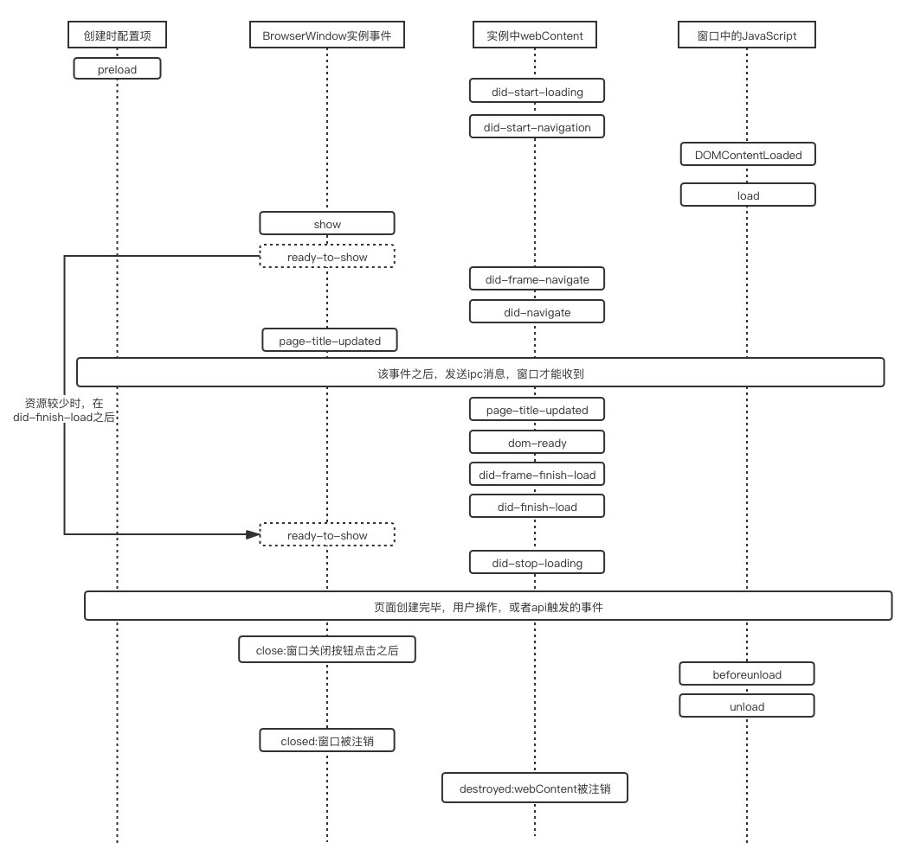

# 1. 窗口各事件触发顺序

## 1.1. 窗口加载时
> 从上到下，依次执行

| 环境                    | 事件                    | 触发时机                                                                                                               |
| ----------------------- | ----------------------- | ---------------------------------------------------------------------------------------------------------------------- |
| webPreferences的preload | -                       | 在页面运行其他脚本之前预先加载指定的脚本 无论页面是否集成Node, 此脚本都可以访问所有Node API 脚本路径为文件的绝对路径。 |
| webContents             | `did-start-loading`     | 当tab中的旋转指针（spinner）开始旋转时，就会触发该事件                                                                 |
| webContents             | `did-start-navigation`  | 当窗口开始导航是，触发该事件                                                                                           |
| 窗口中的`JavaScript`    | `DOMContentLoaded`      | 初始的 HTML 文档被完全加载和解析完成                                                                                   |
| 窗口中的`JavaScript`    | `load`                  | 页面资源全部加载完成之时                                                                                               |
| `BrowserWindow`实例     | `show`                  | 窗口显示时触发时                                                                                                       |
| `webContents`           | `did-frame-navigate`    | `frame`导航结束时时                                                                                                    |
| `webContents`           | `did-navigate`          | `main frame`导航结束时时                                                                                               |
| `BrowserWindow`实例     | `page-title-updated`    | 文档更改标题时触发                                                                                                     |
| `webContents`           | `page-title-updated`    | 文档更改标题时触发                                                                                                     |
| `webContents`           | `dom-ready`             | 一个框架中的文本加载完成后触发该事件                                                                                   |
| `webContents`           | `did-frame-finish-load` | 当框架完成导航（navigation）时触发                                                                                     |
| `webContents`           | `did-finish-load`       | 导航完成时触发，即选项卡的旋转器将停止旋转                                                                             |
| `webContents`           | `did-stop-loading`      | 当tab中的旋转指针（spinner）结束旋转时，就会触发该事件                                                                 |

## 1.2. 窗口加载完毕，用户触发事件（不包括resize和move）

| 事件                     | 作用                                               |
| ------------------------ | -------------------------------------------------- |
| `page-title-updated`     | 文档更改标题时触发                                 |
| `blur`                   | 当窗口失去焦点时触发                               |
| `focus`                  | 当窗口获得焦点时触发                               |
| `hide`                   | 窗口隐藏                                           |
| `show`                   | 窗口显示                                           |
| `maximize`               | 窗口最大化时触发（mac是双击title）                 |
| `unmaximize`             | 当窗口从最大化状态退出时触发                       |
| `enter-full-screen`      | 窗口进入全屏状态时触发                             |
| `leave-full-screen`      | 窗口离开全屏状态时触发                             |
| `enter-html-full-screen` | 窗口进入由HTML API 触发的全屏状态时触发            |
| `leave-html-full-screen` | 窗口离开由HTML API触发的全屏状态时触发             |
| `always-on-top-changed`  | 设置或取消设置窗口总是在其他窗口的顶部显示时触发。 |
| `app-command`            | `window` `linux`独有                               |

## 1.3. 用户移动窗口

1. 移动窗口之前 `will-move`；
2. 移动窗口中 `move`；
3. 移动之后 `moved`；

## 1.4. 用户改变窗口大小
1. 改变之前 `will-resize`；
2. 改变之后 `resize`

## 1.5. 窗口的内容异常事件（`webContent`事件）
| 事件名                      | 错误类型                                                                                                 |
| --------------------------- | -------------------------------------------------------------------------------------------------------- |
| `unresponsive`              | 网页变得未响应时触发                                                                                     |
| `responsive`                | 未响应的页面变成响应时触发                                                                               |
| `did-fail-load`             | 加载失败，[错误码](https://code.google.com/p/chromium/codesearch#chromium/src/net/base/net_error_list.h) |
| `did-fail-provisional-load` | 页面加载过程中，执行了`window.stop()`                                                                    |
| `did-frame-finish-load`     |                                                                                                          |
| `crashed`                   | 渲染进程崩溃或被结束时触发                                                                               |
| `render-process-gone`       | 渲染进程意外失败时发出                                                                                   |
| `plugin-crashed`            | 有插件进程崩溃时触发                                                                                     |
| `certificate-error`         | 证书的链接验证失败                                                                                       |
| `preload-error`             | `preload.js`抛出错误                                                                                     |

## 1.6. 窗口关闭（包括意外关闭）

按触发顺序依次：（带window的是渲染进程中的）

-  关闭之前：close
-  window.onbeforeunload
-  window.onunload
-  关闭之后：closed

## 1.7 文档
1. [BrowserWindow](https://www.electronjs.org/docs/api/browser-window);
2. [webContents](https://www.electronjs.org/docs/api/web-contents);
3. [DOMContended](https://developer.mozilla.org/zh-CN/docs/Web/Events/DOMContentLoaded)