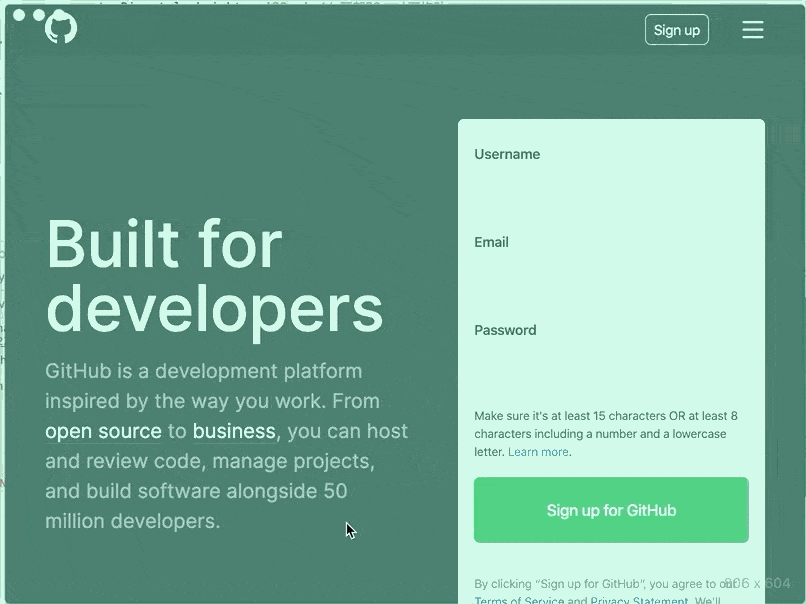
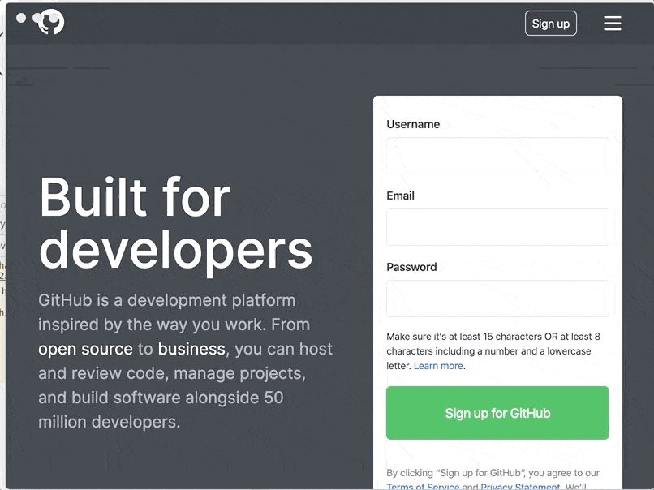
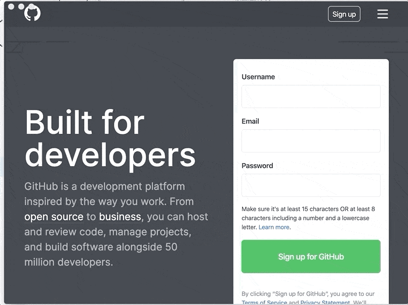

# 1. 窗口类型

## 1.1. 无边框窗口

### 1.1.1. 描述：
无边框窗口是不带外壳（包括窗口边框、工具栏等），只含有网页内容的窗口

### 1.1.2. 实现
`Windows` `macOS` `Linux`
```javascript
// @@code-renderer: runner
// @@code-props: { hideRight: true, height:'100px' }
const { BrowserWindow } = require('electron')
let win = new BrowserWindow({ width: 800, height: 600, frame: false })
win.loadURL('https://github.com')
```
在`macOS`下，还有不同的实现方式，[完整文档](https://www.electronjs.org/docs/api/frameless-window#macos-%E4%B8%8A%E7%9A%84%E5%85%B6%E4%BB%96%E6%96%B9%E6%A1%88)

### 1.1.3. `macOS` 下独有的无边框

- 配置`titleBarStyle: 'hidden'`
> 返回一个隐藏标题栏的全尺寸内容窗口，在左上角仍然有标准的窗口控制按钮（俗称“红绿灯”）


```javascript
// @@code-renderer: runner
// @@code-props: { hideRight: true, height:'100px' }
// 创建一个无边框的窗口
const { BrowserWindow } = require('electron')
let win = new BrowserWindow({ titleBarStyle: 'hidden' })
win.loadURL('https://github.com')
```
效果如下：  


- 配置`titleBarStyle: 'hiddenInset'`
> 返回一个另一种隐藏了标题栏的窗口，其中控制按钮到窗口边框的距离更大。

```javascript
// @@code-renderer: runner
// @@code-props: { hideRight: true, height:'100px' }
// 创建一个无边框的窗口
const { BrowserWindow } = require('electron')
let win = new BrowserWindow({ titleBarStyle: 'hiddenInset' })
win.loadURL('https://github.com')
```
效果如下：  


##### 1.1.0.3.3. 配置`titleBarStyle: 'customButtonsOnHover'` 
效果如下：  



### 1.1.4. 无边框窗口常见的问题
- 窗口顶部无法拖拽的问题
默认情况下, 无边框窗口是不可拖拽的。 应用程序需要在 `CSS` 中指定 `-webkit-app-region: drag` 来告诉 `Electron` 哪些区域是可拖拽的（如操作系统的标准标题栏），在可拖拽区域内部使用 `-webkit-app-region: no-drag` 则可以将其中部分区域排除。 请注意, 当前只支持矩形形状。[完整文档](https://www.electronjs.org/docs/api/frameless-window#%E5%8F%AF%E6%8B%96%E6%8B%BD%E5%8C%BA)

使用`-webkit-app-region: drag` 来实现拖拽，但是会导致内部的`click`事件失效。这个时候可以将需要`click`元素设置为`-webkit-app-region: no-drag`。具体的细节可看[issues](https://github.com/electron/electron/issues/3647)

为了不影响窗口，这里拖拽的代码，应该在`preload`触发。
核心代码：
```typescript
// 在顶部插入一个可以移动的dom
function initTopDrag() {
  const topDiv = document.createElement('div') // 创建节点
  topDiv.style.position = 'fixed' // 一直在顶部
  topDiv.style.top = '0'
  topDiv.style.left = '0'
  topDiv.style.height = '20px' // 顶部20px才可拖动
  topDiv.style.width = '100%' // 宽度100%
  topDiv.style.zIndex = '9999' // 悬浮于最外层
  topDiv.style.pointerEvents = 'none' // 用于点击穿透
  // @ts-ignore
  topDiv.style['-webkit-user-select'] = 'none' // 禁止选择文字
  // @ts-ignore
  topDiv.style['-webkit-app-region'] = 'drag' // 拖动
  document.body.appendChild(topDiv) // 添加节点
}

window.addEventListener('DOMContentLoaded', function onDOMContentLoaded() {
    initTopDrag()
})
```
试一试
```javascript
// @@code-renderer: runner
// @@code-props: { hideRight: true, height:'200px' }
const path = require('path')
const { BrowserWindow } = require('electron')

const BaseWebPreferences = {
  nodeIntegration: true,
  preload: path.resolve(__dirname, './windowType.js'),
}

// 主窗口代码
const win = new BrowserWindow({ webPreferences: BaseWebPreferences, frame: false })
win.loadURL('https://github.com')
```

## 1.2. 父子窗口
子窗口始终在父窗口之上，在 __窗口之间通信__ 章节中介绍到父子窗口之间的通信，[__窗口之间通信__](./index.html#/browser/communication)章节

```javascript
// @@code-renderer: runner
// @@code-props: { hideRight: true, height:'100px' }
const { BrowserWindow } = require('electron')

let top = new BrowserWindow()
let child = new BrowserWindow({ parent: top })
child.show()
top.show()
```

## 1.3. 模态窗口
模态窗口也是一种父子窗口，只不过展示会有不同
```javascript
// @@code-renderer: runner
// @@code-props: { hideRight: true, height:'100px' }
const { BrowserWindow } = require('electron')

let top = new BrowserWindow()
let child = new BrowserWindow({ parent: top, modal: true, show: false })
child.loadURL('https://github.com')
child.once('ready-to-show', () => {
  child.show()
})
```