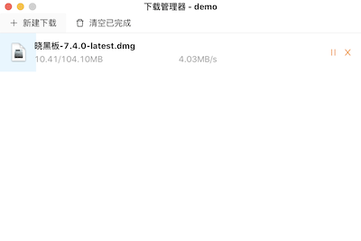
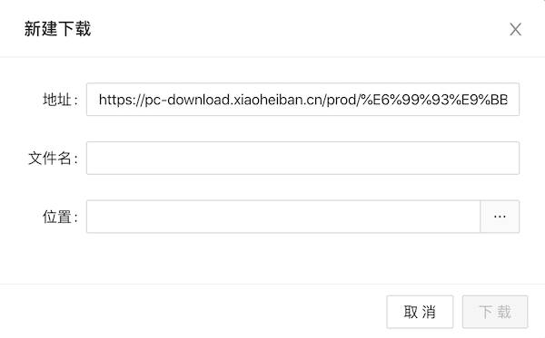
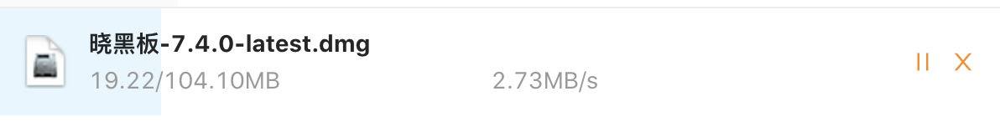
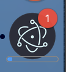

在 electron 端的下载行为，都会触发 session 的 will-download 事件。

在该事件里面可以获取到 downloadItem 对象，通过 downloadItem 对象可以实现：

- 设置保存路径
- 下载进度、速度
- 用户行为，比如暂停、恢复下载等
- 保存下载记录

先来看一下实现的效果图：


  
### 新建下载流程图


### 触发下载

调用 webContents 的 downloadURL 方法，触发 will-download 事件。

```js
win.webContents.downloadURL(url)
```

### 设置保存路径

如果没有设置保存路径，electron 会自动弹出系统的保存对话框。不想使用系统的保存对话框，可以使用 setSavePath 方法，当有重名文件时，会直接覆盖下载。

```js
item.setSavePath(path)
```

为了更好的用户体验，需要实现修改保存路径的功能。当点击位置输入框时，渲染进程通过 ipc 与主进程通信，打开系统文件选择对话框。



```js
// 打开系统文件选择对话框
const { canceled, filePaths } = await dialog.showOpenDialog({
  title: '选择保存位置',
  properties: ['openDirectory', 'createDirectory'],
  defaultPath: oldPath || app.getPath('downloads')
})
```

### 暂停/恢复和取消

拿到 DownloadItem 后，暂停、恢复和取消分别调用 pause、resume 和 cancel 方法。当我们要删除列表中正在下载的项，需要先调用 cancel 方法取消下载。

### 下载进度

在 DownloadItem 中监听 updated 事件，可以实时获取到已下载的字节数据，来计算下载进度和每秒下载的速度。

```js
// 计算下载进度
const progress = item.getReceivedBytes() / item.getTotalBytes()
```



在下载的时候，想在 Mac 系统的程序坞和 Windows 系统的任务栏展示下载信息，比如：
 - 下载数：通过 app 的 badgeCount 属性设置，当为 0 时，不会显示。也可以通过 dock 的 setBadge 方法设置，该方法支持的是字符串，如果不要显示，需要设置为''。
 - 下载进度：通过窗口的 setProgressBar 方法设置。

> 由于 Mac 和 Windows 系统差异，下载数仅在 Mac 系统中生效。




```js
app.dock.setBadge('1')
```

下载进度（Windows 系统任务栏、Mac 系统程序坞）显示，

```js
// 记录上一次下载的字节数据
let prevReceivedBytes = 0

item.on('updated', (e, state) => {
  const receivedBytes = item.getReceivedBytes()
  // 计算每秒下载的速度
  downloadItem.speed = receivedBytes - prevReceivedBytes
  prevReceivedBytes = receivedBytes

  // 计算下载进度
  const progress = item.getReceivedBytes() / item.getTotalBytes()

  // 更新任务栏进度
  win.setProgressBar(progress)
  // 通知渲染进程，更新下载状态
  webContents.send('downloadItemUpdate', downloadItem)
})
```

### 下载完成

在 DownloadItem 中监听 done 事件，处理已完成、中断和取消下载项。

```js
item.on('done', (e, state) => {
  downloadItem.state = state
  downloadItem.receivedBytes = item.getReceivedBytes()
  downloadItem.lastModifiedTime = item.getLastModifiedTime()

  if (state !== 'cancelled') {
    downloadCompletedIds.push(downloadItem.id)
  }

  // 更新任务栏
  setTaskbar()
  // 下载成功
  if (state === 'completed') {
    app.dock.downloadFinished(downloadItem.path)
  }

  setDownloadStore(downloadItemData)
  // 通知渲染进程，更新下载状态
  webContents.send('downloadItemDone', downloadItem)
})
```

### 打开文件和打开文件所在位置

使用 electron 的 shell 模块来实现打开文件（openPath）和打开文件所在位置（showItemInFolder）。由于 openPath 方法支持返回值 `Promise<string>`，当不支持打开的文件，系统会有相应的提示，而 showItemInFolder 方法返回值是 `void`。如果需要更好的用户体验，可使用 nodejs 的 fs 模块，先检查文件是否存在。

```ts
import fs from 'fs'

// 打开文件
const openFile = (path: string): boolean => {
  if (!fs.existsSync(path)) return false

  shell.openPath(path)
  return true
}

// 打开文件所在位置
const openFileInFolder = (path: string): boolean => {
  if (!fs.existsSync(path)) return false

  shell.showItemInFolder(path)
  return true
}
```

### 文件图标

很方便的是使用 app 模块的 getFileIcon 方法来获取系统关联的文件图标，返回的是 `Promise<NativeImage>` 类型，我们可以用 toDataURL 方法转换成 base64，不需要我们去处理不同文件类型显示不同的图标。

```ts
const getFileIcon = async (path: string) => {
  const iconDefault = './icon_default.png'
  if (!path) Promise.resolve(iconDefault)

  const icon = await app.getFileIcon(path, {
    size: 'normal'
  })

  return icon.toDataURL()
}
```

### 下载记录

在 will-download 事件里，使用 electron-store 将下载记录保存在本地。
